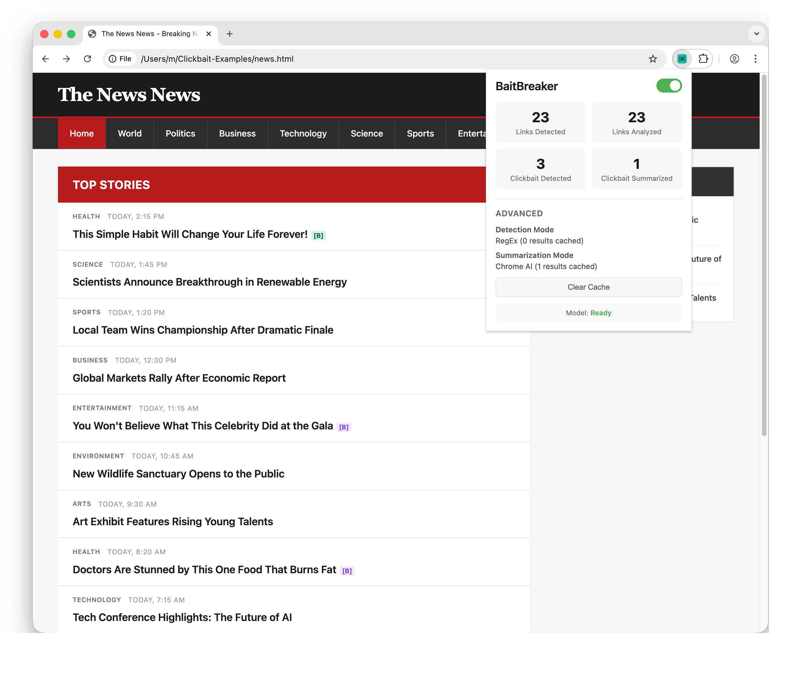
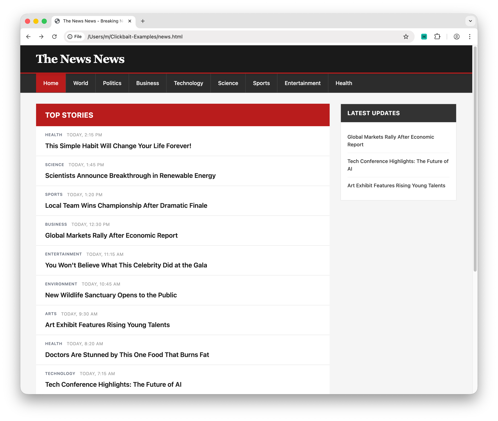
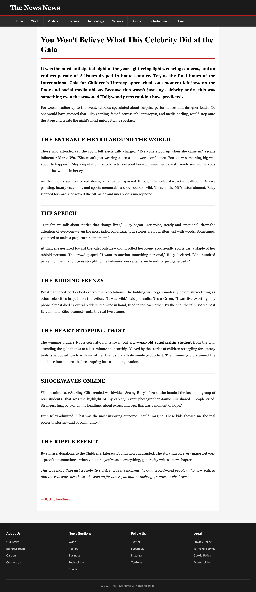

# BaitBreaker (Chrome Extension)
**Fighting Clickbait with instant title answers** BaitBreaker scans pages for clickbait‑style links, adds a `[B]` badge and on hover shows a concise answer distilled from the target article. So you don't have to click.

## Key features
- Detects likely clickbait titles (regex + on‑device AI)
- Appends `[B]` badge next to links
- Hover the badge to see the **quick answer**
- All AI runs **on‑device** with Chrome’s built‑in Gemini Nano
- One‑time model download; privacy‑friendly (no server calls for AI)

## Screenshots

### BaitBreaker Tooltip

The tooltip feature is one of BaitBreaker's core functionalities. When you hover over a `[B]` badge next to a clickbait link, BaitBreaker displays a concise summary extracted from the target article. This allows you to quickly understand what the article is about without having to click through. The summary is generated on-device using Chrome's built-in Gemini Nano AI model, ensuring your privacy while providing instant answers.


In this screenshot, you can see the tooltip appearing when hovering over a clickbait link. The `[B]` badge is clearly visible, and the tooltip shows the AI-generated summary that helps you decide whether the article is worth your time.

### BaitBreaker Settings

BaitBreaker includes a settings page where you can customize the extension's behavior. From the settings, you can control detection modes, enable or disable features, and manage the on-device AI model. This screenshot shows the settings interface accessible through the extension popup.



The settings page provides options to preload the on-device AI model, adjust detection sensitivity, and configure other extension preferences. This gives you full control over how BaitBreaker works on your browsing experience.

### Newspage without BaitBreaker

To demonstrate BaitBreaker's impact, here are comparison screenshots showing a news page before the extension is active. These images illustrate how clickbait links appear in their natural state without any indicators or warnings.



This screenshot shows a typical news page layout with clickbait headlines. Without BaitBreaker, users have no indication of which articles might be misleading or which ones they can get quick answers for without clicking through.



Here you can see an individual article page without BaitBreaker's features enabled. This comparison helps illustrate the value that BaitBreaker adds by providing instant context and summaries for clickbait content throughout your browsing experience.


## Build & Install

1. **Clone this repository**
   ```bash
   git clone git@github.com:ZAAI-com/BaitBreaker.git
   cd BaitBreaker
   ```

2. **Install dependencies and build**
   ```bash
   npm install
   npm run build
   ```

3. **Load the extension in Chrome**
   - Open Chrome and navigate to `chrome://extensions/`
   - Enable **Developer mode** (toggle in top-right corner)
   - Click **Load unpacked**
   - Select the `dist` folder (contains the built extension)
   - The BaitBreaker icon should appear in the Chrome Extension toolbar

4. **Verify installation**
   - Visit any news website (e.g. [The News News](../Clickbait-Examples/news.html) example in this repository)
   - Look for `[B]` badges next to links that appear to be clickbait
   - Hover over a badge to see the summary tooltip
   ```


## Data Flow

1. **Link Detection Flow**
   ```
   → Links Detected
   → Links Analyzed
   → Clickbait Titles Detected
   → Apply [B] Indicator with purple background

   ```

2. **Summary Generation Flow**
   ```
   → Clickbait Articles Summarized
   → Apply [B] Indicator with green background

   ```

**Clickbait Patterns in RegEx Detection Mode**
- Curiosity gaps: "You won't believe...", "What happened next..."
- Emotional triggers: "Shocking", "Heartbreaking", "Mind-blowing"
- Listicles: "10 Ways...", "Top 5..."
- Questions: Ending with "?"
- Misleading: "The real reason...", "Here's why..."


## Privacy Guarantee
- ✅ All AI processing happens **on-device** using Chrome's built-in Gemini Nano
- ✅ No network requests for AI operations (only for fetching article HTML)
- ✅ No data collection or analytics
- ✅ Cache is stored locally and expires automatically
- ✅ Open source - you can audit the code to verify privacy claims


## Architecture Overview

BaitBreaker uses a three-layer architecture to detect clickbait and generate summaries:

```
┌─────────────────────────────────────────────────────────────┐
│                    Web Page (News Site)                     │
├─────────────────────────────────────────────────────────────┤
│  Content Script (content-script.js)                         │
│  • Scans DOM for links                                      │
│  • Adds [B] badges to clickbait links                       │
│  • Manages tooltip display                                  │
│  • Injects in-page script for AI APIs                       │
├─────────────────────────────────────────────────────────────┤
│  In-Page Script (inpage.js)                                 │
│  • Accesses Chrome Built-in AI APIs                         │
│  • Prompt API: Classifies clickbait                         │
│  • Summarizer API: Generates summaries                      │
│  (Must run in page context, not service worker)             │
├─────────────────────────────────────────────────────────────┤
│  Service Worker (service-worker.js)                         │
│  • Receives classification requests                         │
│  • Fetches article HTML (cross-origin)                      │
│  • Manages cache (classification & summary results)         │
│  • Coordinates between content script and in-page script    │
└─────────────────────────────────────────────────────────────┘
```


## Next Tasks
- Add more text patterns to RegEx Detection Mode
- Switch Detection Mode to Chrome Built-in AI
- Open articles in Ingognido mode
- Fix service error: "Service not initialized. Chrome AI APIs may not be available."

